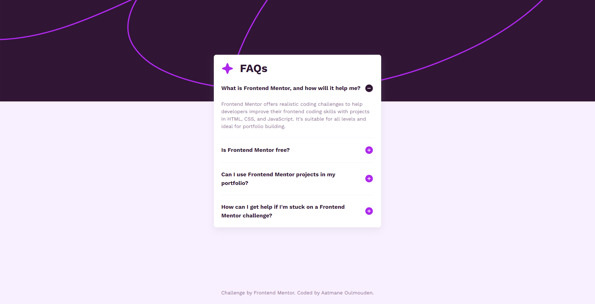

# Frontend Mentor - FAQ accordion solution

This is a solution to the [FAQ accordion challenge on Frontend Mentor](https://www.frontendmentor.io/challenges/faq-accordion-wyfFdeBwBz). Frontend Mentor challenges help you improve your coding skills by building realistic projects. 

## Table of contents

- [Overview](#overview)
  - [The challenge](#the-challenge)
  - [Screenshot](#screenshot)
  - [Links](#links)
- [My process](#my-process)
  - [Built with](#built-with)
- [Author](#author)

## Overview

### The challenge

Users are able to:

- Hide/Show the answer to a question when the question is clicked
- Navigate the questions and hide/show answers using keyboard navigation alone (using numbers from 1 to 4)
- View the optimal layout for the interface depending on their device's screen size
- See hover and focus states for all interactive elements on the page

### Screenshot

### Links

<!-- - Solution URL: [Add solution URL here](https://github.com/aatmaneoulmouden/faq-accordion/) -->
- Live Site URL: [Visit the website](https://aatmaneoulmouden.github.io/faq-accordion/)

## My process

### Built with

- Semantic HTML5 markup
- Flexbox
- Mobile-first workflow
- Vanilla JS
- [Tailwind CSS](https://tailwindcss.com/) - For styles

## Author

- Frontend Mentor - [@aatmaneoulmouden](https://www.frontendmentor.io/profile/aatmaneoulmouden)
- LinkedIn - [@aatmaneoulmouden](https://www.linkedin.com/in/aatmaneoulmouden/)